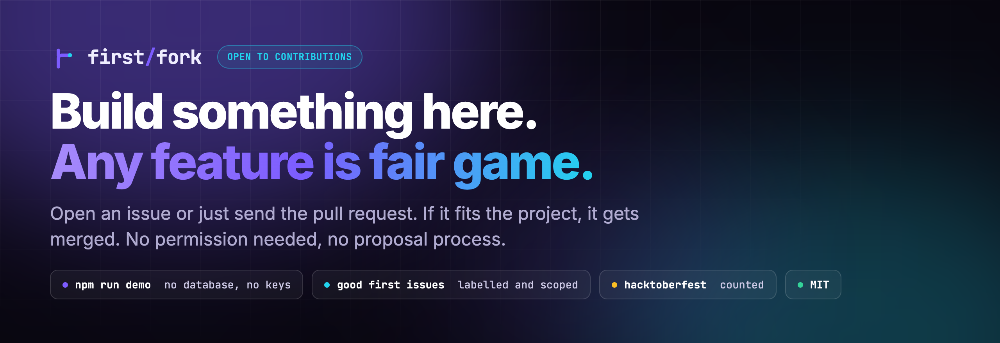

<p align="center">
  
</p>

# FirstFork

[](https://github.com/anshc022/oss-match/actions/workflows/ci.yml)
[](LICENSE)
[](https://github.com/anshc022/oss-match/labels/good%20first%20issue)

Matches developers to open source GitHub issues by skill level, language and
interest, then walks first-timers through the contribution one command at a
time. Every command in the guide is filled in with the repo and issue the user
actually picked.

**New here?** [CONTRIBUTING.md](CONTRIBUTING.md) has setup from zero and a list
of what makes a good first pull request. Issues labelled
[`good first issue`](https://github.com/anshc022/oss-match/labels/good%20first%20issue)
are picked to be a reasonable first landing spot.

## Open to contributions

You do not need permission to build something here.

- **Pick an open issue**, or **open a pull request for an idea nobody has raised
  yet**. Both are welcome. There is no proposal process to clear first.
- **Any feature is fair game.** If it fits the project and the code is sound, it
  gets merged. If it does not fit, you will get a reason, not silence.
- **You do not have to finish alone.** Open a draft pull request early and ask.
  A half-working branch with a question attached is a perfectly good thing to
  send.
- **Not code counts too.** Documentation, a test for untested behaviour, an
  accessibility fix, a bug report with real reproduction steps.

Claiming an issue is one comment saying you want it. It is yours from then on,
and nobody will take it out from under you.

The setup is one command and needs no accounts:

```bash
npm install && npm run demo
```

Everything worth knowing before your first pull request is in
[CONTRIBUTING.md](CONTRIBUTING.md): branch naming, what the checks run, and what
happens after you open it.

## Screenshots

<!-- Replace these placeholders with real captures. Keep the file names so the
     links keep working: docs/screenshots/<name>.png -->

| | |
| --- | --- |
| **Landing** <br>  | **Swipe feed** <br>  |
| **List feed** <br>  | **Contributor guide** <br>  |
| **Repo Deep Dive** <br>  | **Skill graph** <br>  |


## Stack

Next.js 14 (App Router) · TypeScript · MongoDB via Mongoose · NextAuth with
GitHub OAuth · Tailwind + shadcn/ui · Octokit · react-tinder-card ·
@paper-design/shaders-react · lucide-react

## Getting started

Run it with nothing to set up:

```bash
npm install
npm run demo
```

Open <http://localhost:3000> and press **Continue with the demo account**.

`npm run demo` starts a temporary in-memory database, seeds it with real issues
from `fixtures/demo-issues.json`, and signs you in as a local account, so there
is no database to provision and no GitHub OAuth app to register. Nothing is
written to disk. The first run downloads MongoDB's binaries, which takes about a
minute.

The demo sign-in cannot be enabled on a deployed build: it needs
`DEMO_MODE=true`, refuses when `NODE_ENV` is `production`, and refuses whenever
`VERCEL` is set. The gates are asserted in `tests/demo.test.ts`.

### The full setup

Needed only for work on sign-in, the background fetcher or the AI features:

```bash
cp .env.example .env.local   # then fill it in
npm run dev
```

That path needs a MongoDB instance and a GitHub OAuth app. `.env.example`
documents every variable, including the callback URL to register.
[CONTRIBUTING.md](CONTRIBUTING.md#set-up-your-local-copy) walks through both
from scratch, including MongoDB Atlas free-tier setup, if you have not done this
before.

The feed reads from MongoDB rather than from GitHub, so a fresh database shows
nothing until the fetcher has run once:

```bash
curl -H "Authorization: Bearer $CRON_SECRET" \
  "http://localhost:3000/api/cron/fetch-issues?force=1"
```

`GITHUB_TOKEN` is optional but close to required in practice. Without it the
GitHub API allows 60 core requests per hour and 10 searches per minute, which a
single feed load can exhaust. Any token with public read access works; no scopes
are needed.

| Command | What it does |
| --- | --- |
| `npm run dev` | Dev server on :3000 |
| `npm run build` | Production build |
| `npm test` | Unit and integration tests |
| `npm run typecheck` | `tsc --noEmit` |
| `npm run lint` | ESLint |

Tests use `mongodb-memory-server`, so nothing external is needed to run them.

## How matching works

Six factors, each normalised to 0-1, combined with weights that sum to 1. The
match score on a card is therefore readable directly as a percentage.

| Factor | Weight | What it measures |
| --- | --- | --- |
| Language | 0.26 | Exact match to the user's languages, partial credit for adjacent ones |
| Difficulty | 0.18 | Issue labels mapped against the user's stated level |
| Repo health | 0.18 | Stars, forks, a push in the last 30 days, CI, adoption |
| Contention | 0.15 | Comment volume and assignment, as a proxy for "already claimed" |
| Freshness | 0.13 | Age of the issue, with credit for recent maintainer activity |
| Welcoming | 0.10 | CONTRIBUTING.md, CODE_OF_CONDUCT.md, a detailed issue body |

Interest overlap with repo topics applies a small multiplier rather than a
weighted term, so it nudges ordering without overriding readability.

Deliberate choices worth knowing about:

- **Difficulty never filters.** An advanced user still sees "good first issue"
  results, ranked below meatier work; a beginner still sees "help wanted"
  rather than only the small curated pool.
- **Activity outweighs popularity.** A live 200-star repo beats a dead
  40k-star one. Archived repos score zero health.
- **Adoption gates health.** A repo with no stars or forks is unproven no
  matter how recently it was pushed, so its health score is scaled down.
- **Assigned issues are dropped**, not merely discounted.
- **Issues whose repo metadata could not be fetched are excluded.** Ranking one
  without health signals floats brand-new zero-star repos to the top.

`src/lib/scoring.ts` holds all of it, and `tests/scoring.test.ts` pins the
behaviour above.

## Architecture: fetching is decoupled from serving

Nothing on the request path talks to GitHub. A scheduled job fills a MongoDB
collection; the feed reads it. Traffic and GitHub rate limit are independent
variables, which is the whole point when a Hacktoberfest spike means more
readers rather than more budget.

```
  cron (hourly)                          user request
       |                                      |
  runFetchCycle                          GET /api/issues/feed
       |                                      |
  Bottleneck queue  --> GitHub API            |
       |                                      |
  scoreBase()                                 |
       |                                      v
       +------> issues collection -----> rank per user -> page
                (Mongo)
```

`src/lib/fetcher/` holds the background side. The feed route imports none of
it: its module graph contains no Octokit client at all, so a GitHub call
cannot creep back onto the request path by accident.

### Two-stage scoring

Four of the six factors (repo health, freshness, contention, welcoming) depend
only on the issue and its repo, so the fetcher computes them once and stores
the result as `baseScore` with a `lastScoredAt` stamp. The other two (language
fit, difficulty fit) and the interest multiplier depend on who is asking, so
they cannot be precomputed.

The feed therefore ranks in two stages: Mongo narrows and orders by the indexed
`baseScore`, then the returned window is re-ranked with the full per-user
algorithm. The window is deliberately larger than the page so the two stages do
not disagree at a page boundary. Both stages call the same `scoreIssue`, so a
cached document scores identically to a live one; `tests/issue-collection.test.ts`
pins that.

### Rate limits

The fetcher queues every GitHub call through Bottleneck, with a separate lane
per rate-limit resource. That separation matters: `core` allows 5,000/hour
while `search` allows 30/minute, so a single shared floor would read every
healthy search response as exhausted. Guards are proportional to the advertised
limit rather than absolute, for the same reason: the same code runs against a
5,000/hour App installation and a 60/hour unauthenticated client.

Three protections, in order of how often they fire:

| Signal | Response |
| --- | --- |
| Budget dropping | Widen the gap between calls to spread what is left over the time until reset |
| Budget at the reserve floor | Stop handing out work on that lane; the next cycle resumes |
| Secondary ("abuse") limit | Close the lane for the whole cycle |

That last one is separate from the hourly budget: it fires on request *pace*,
and `x-ratelimit-remaining` still reads healthy when it does. GitHub asks for a
wait of minutes, so a cycle that keeps probing just extends the block.

The floor is checked between queued jobs, and one job can fan out to several
calls (resolving a repo costs three), so the budget can undershoot the floor by
a couple of requests. The reserve is sized to absorb that.

### Caching and skipped work

Two mechanisms, doing different jobs:

- **`lastFetchedAt`** enforces the per-query refresh interval, so an hourly
  cron only spends budget on queries that are actually due.
- **`resultHash`** fingerprints the result set. If a query returns exactly what
  it returned last cycle, scoring and repo resolution are skipped. Measured on
  a real cycle: six queries, 100% unchanged, 11 seconds and zero core budget
  against roughly 60 seconds when processing.

`etag` is stored and replayed as `If-None-Match`, but be aware that **GitHub's
search API does not currently emit ETags** — it answers `cache-control:
no-cache` — so that path never produces a 304 today. The code is kept because
the contract costs nothing to honour and other endpoints do support it. Note
also that a 304, where one is available, still decrements the rate limit;
measured against the live API, not taken from the docs.

## Data model

- **User** — `githubId`, `username`, `avatarUrl`, `skillLevel`, `interests[]`,
  `languages[]`, `timeAvailability`, plus `suggestedLanguages[]` inferred from
  public repos at first login and `onboardedAt`.
- **SavedIssue** — the issue and repo snapshot, `matchScore`, `status`
  (saved / in-progress / contributed), and `guideProgress[]` as completed step
  numbers. Unique per `(userId, issueUrl)`.
- **SkippedIssue** — keeps skipped cards out of the feed, expiring after 60 days.
- **IssueCache** / **RepoMeta** — the caches described above, both TTL-indexed.

## API

| Route | Purpose |
| --- | --- |
| `/api/auth/[...nextauth]` | GitHub OAuth |
| `/api/onboarding` | Read and write matching preferences |
| `/api/issues/feed` | Read, rank and paginate the cached feed. No GitHub call. |
| `/api/issues/save` | Save or skip an issue |
| `/api/issues/saved` | The user's list |
| `/api/issues/status` | Update status or guide progress |
| `/api/repos/contributing` | Fetch and summarise a repo's CONTRIBUTING.md |
| `/api/cron/fetch-issues` | Background fetch cycle. Secret-protected, see CRON.md. |

Every route requires a session. Writes are scoped by `userId`, so one user
cannot read or mutate another's saved issues.

## The contribution guide

Eight steps, defined in `src/lib/guide.ts` and resolved against a specific repo
and issue by `buildGuideSteps`. The clone command points at the user's own
fork, the branch name embeds the issue number, the commit and PR templates are
pre-filled, and `Fixes #N` is wired up so merging closes the issue.

Step 3 fetches the repo's CONTRIBUTING.md and extracts an outline. The path is
discovered through GitHub's community profile API rather than guessed, because
real repos use `contributing.md`, `.github/CONTRIBUTING.md` and
`docs/contributing.rst` about as often as the canonical spelling. The summary is
extractive, never generated, so it cannot invent a rule the project did not
write. Repos with no contributing guide get a README fallback instead.

Progress is persisted per saved issue, and completing any step moves it from
saved to in-progress. Nothing marks itself contributed automatically, since only
a merged PR earns that.

## AI features

Two features use a language model, both behind an OpenAI-compatible endpoint
configured with `LLM_API_KEY`, `LLM_BASE_URL` and `LLM_MODEL`. Both are
background or on-demand jobs, never on a page load, and both degrade to a
heuristic built from the same GitHub data when the model is unavailable, times
out, or returns something that fails validation.

### Skill graph

Replaces the self-reported level with one computed from what the user has
actually shipped. `src/lib/skillgraph/` collects their non-fork repos, recent
commits in each, and merged pull requests with size, capped at roughly forty
API calls. The model returns per-language proficiency with a confidence, an
overall tier, and a short written assessment; the heuristic derives the same
shape from commit and PR counts.

It runs on request from the profile page, on first profile view after sign-up,
and otherwise only when the last result is more than thirty days old. Never on
login. Scoring gives the computed skills precedence over the onboarding list,
blended by confidence, and uses the computed tier for difficulty fit.

### Suggested contact

For each repo, who is actually answering right now. `src/lib/mentor/` pulls the
last sixty days of issue comments, merged PRs and reviews, tallies per person,
and asks the model for one to three people likely to reply fast to a newcomer.
Reviewing and commenting outrank merging your own work, so it often is not the
repo owner. Every pick is checked against the real list, so the model cannot
invent a username. Cached per repo for seven days; a couple of stale repos are
refreshed on each fetch cycle, and a page that finds none triggers one in the
background and shows the result on the next visit.

### Repo Deep Dive

An interactive, animated report of a repository, opened from the Deep Dive
button on an issue's detail page, for orientation before cloning anything.
`src/lib/deepdive/` reads the whole file tree in one Git Trees call plus the
README and dependency manifests, then asks the model for a plain-language map:
five to twelve modules with a category and a layer (entry, logic, data), the
connections between them, and where this specific issue most likely lives.
Without the model it falls back to a map built from folder names.

Three views, all in `src/components/deepdive/`: an isometric SVG file tree
where folders are extruded blocks that open with a spring re-layout and the
issue's files glow; a three.js architecture graph stacked by layer with orbit
controls, hover highlighting, camera fly-to, and slow particles along the
edges, loaded lazily and replaced by a 2D SVG graph where WebGL is missing;
and a left-to-right flow chart of the path through the issue whose connecting
line draws in as each step springs into place.

Reports cache per repo for fourteen days and the issue mapping per issue.
Generation never blocks the page: the sheet shows the stage it is on and polls.
Motion respects `prefers-reduced-motion`, which turns off parallax, idle
rotation, particles and stagger.

### Latency

The configured model reasons before answering, and a trivial request has been
measured at over ninety seconds at default effort. Calls that need a long JSON
reply pass `reasoning_effort: "low"`, which brings a repo architecture map down
to roughly fifteen seconds and leaves the token budget for the answer rather
than the thinking.

The cron path still gives the model only fifteen seconds and falls back to the
heuristic. Every route declares `maxDuration = 60`, the ceiling on Vercel's
Hobby plan, so a skill refresh that runs long saves its heuristic result and
finishes on the next visit rather than being killed mid-write.

## Deploying on Vercel Hobby

The app is built to run on Vercel's free **Hobby** plan.

> **Hobby is for non-commercial use only.** Vercel's terms restrict the Hobby
> plan to personal, non-commercial projects: no ads, no paid features, no
> business use. A deployment that starts making money needs a Pro plan.

### 1. Import the repository

In the Vercel dashboard, **Add New → Project**, import this repository, and keep
the detected Next.js defaults. Do not deploy yet; add the environment variables
first.

Vercel Hobby can only connect to repositories owned by a personal GitHub
account. A repository under a GitHub **organization** needs a Pro team, or the
repository has to be transferred to a personal account.

### 2. Environment variables

Add everything in `.env.example` under **Settings → Environment Variables**.
Scope matters more than usual here, because this is a public repository and any
pull request, including one from a stranger's fork, produces a Preview
deployment.

| Variable | Production | Preview | Notes |
| --- | --- | --- | --- |
| `MONGODB_URI` | production database | **a separate database** | Never the same one. A preview build must not be able to write to production data. |
| `NEXTAUTH_SECRET` | yes | yes | Different values per environment is fine. |
| `NEXTAUTH_URL` | your production domain | leave unset | See below. |
| `GITHUB_CLIENT_ID` / `GITHUB_CLIENT_SECRET` | yes | optional | Sign-in on previews needs a second OAuth app, since callback URLs must match exactly. |
| `CRON_SECRET` | yes | yes | Same value the scheduled workflow sends. |
| `GITHUB_TOKEN` or the `GITHUB_APP_*` trio | yes | **no** | Fetching is a scheduled job; previews do not need credentials to run it. |
| `LLM_API_KEY` | yes | **no**, or a separate low-limit key | Every AI feature degrades to a heuristic without it, so previews stay functional. |
| `HACKTOBERFEST_MODE` / `FETCH_BOOST_MODE` | as you like | as you like | Plain booleans, no secret. |

**`NEXTAUTH_URL` per environment.** Production gets your real domain, for
example `https://oss-match.vercel.app`. Preview URLs are generated per
deployment, so a fixed value would be wrong on every one. Leave it unset for
Preview and let NextAuth read the deployment host, or set it from Vercel's own
system variable:

```
NEXTAUTH_URL = https://$VERCEL_URL
```

**Require approval for fork pull requests.** Under **Settings → Git**, turn on
deployment protection for pull requests from forks. Without it, anyone opening a
pull request triggers a build with your Preview environment variables attached.

### 3. Scheduled fetching

`vercel.json` declares one cron job. **Hobby runs cron jobs at most once per
day**, and not at a guaranteed minute, so the schedule there is daily and exists
only as a backstop.

The real cadence comes from GitHub Actions:
[`.github/workflows/fetch-issues.yml`](.github/workflows/fetch-issues.yml) calls
the same route every three hours, and can be run by hand from the Actions tab.
It needs two repository secrets:

| Secret | Value |
| --- | --- |
| `APP_URL` | `https://your-domain.vercel.app`, no trailing slash |
| `CRON_SECRET` | the same value set in Vercel |

Function duration on Hobby is capped at 60 seconds. Every route here declares 60
or less, and the fetch cycle stops starting new work before the deadline rather
than being killed mid-write.

### 4. After the first deploy

- Update the OAuth app's callback URL to
  `https://your-domain.vercel.app/api/auth/callback/github`.
- Allow Vercel's outbound addresses in MongoDB Atlas **Network Access**. Hobby
  deployments do not have static IPs, so this generally means `0.0.0.0/0` plus a
  strong database password and a user scoped to this one database.
- Run the **Fetch issues** workflow once by hand to populate the feed.

## Development notes

- Mongoose registers each model once per process and Next's hot reload keeps
  that instance. After adding a field to a schema, restart `npm run dev`;
  otherwise strict mode silently drops writes to the new field and reads return
  nothing, with no error anywhere.
- The production build overwrites `.next` while the dev server is using it.
  Restart the dev server after `npm run build`.

## Known limitations

- Two user-facing paths still call GitHub: the contribution guide page and
  `/api/repos/contributing`, both for CONTRIBUTING.md, which is not cached.
  Repo metadata behind them is cached, so a guide open costs roughly one or two
  API calls. Closing that gap means caching the contributing summary during the
  fetch cycle.
- The feed can return several issues from the same repo in a row, because
  nothing caps per-repo representation. Noticeable on a swipe UI when one
  project bulk-files labelled issues.
- Skill graphs for users with little public activity return no per-language
  bars, only a tier and a note. That is the model declining to guess, not a
  bug, and the onboarding answers still drive matching for them.
- Fetch coverage is a fixed language list (`FETCH_LANGUAGES`). A user whose
  languages fall outside it sees an empty feed rather than a slow one, since
  the request path can no longer fall back to a live search.

- Contention is inferred from comment count and assignment. The search API does
  not expose linked pull requests, so a quiet issue with an open PR against it
  can still rank highly.
- Scoring is per-request over cached candidates. It is cheap, but a user with
  many languages selected will see only their top four searched.
- `Mark as contributed` is self-reported. Verifying a merged PR would need
  write-adjacent scopes the app deliberately does not request.

## Contributing

Pull requests are welcome, including small ones and documentation fixes. Start
with [CONTRIBUTING.md](CONTRIBUTING.md); it covers local setup from zero,
branch and commit conventions, and the checks CI runs.

Everyone taking part is expected to follow the
[Code of Conduct](CODE_OF_CONDUCT.md).

## License

[MIT](LICENSE).
